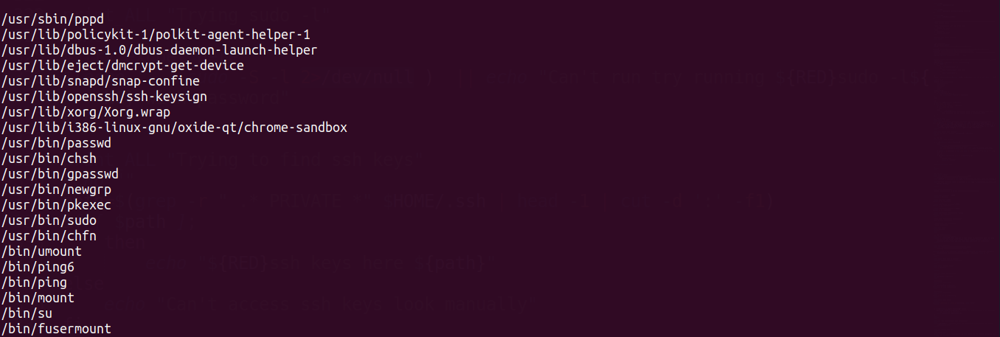

# LinGhost - Linux Privilege Escalation Tool

> Saikat Karmakar | Aug : 2021


- This tool gives information about critical files which can be used for privilege escalation on linux/unix systems. It is heavily inspired by `Linpease` but more simple and intended to do CTF challenges like HackTheBox, TryHackme etc.

- I used the methods of `HackTricks`(https://book.hacktricks.xyz/linux-unix/privilege-escalation) and tried to keep this as simple as possible and beginner friendly.

#### Usage
```bash
git clone https://github.com/Aviksaikat/LinGhost
cd LinGhost
chmod +x ./linGhost.sh
./linGhost.sh
```

#### Screenshots
- Banner


- User information 

- Sudo version

- Path information

- Kernel information

- Useful softwares installed on the machine

- Cronjobs 

- Routing table

- Hosts file

- Open local ports 

- Suggested commands

- SUID binaries


[-] Todo : Documentation

##### P.S. This is not a Linpease alternative. It"s for fun and CTF purpose only.